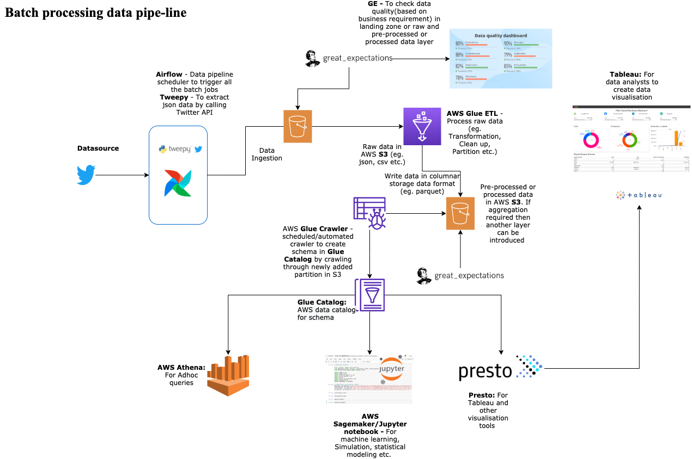
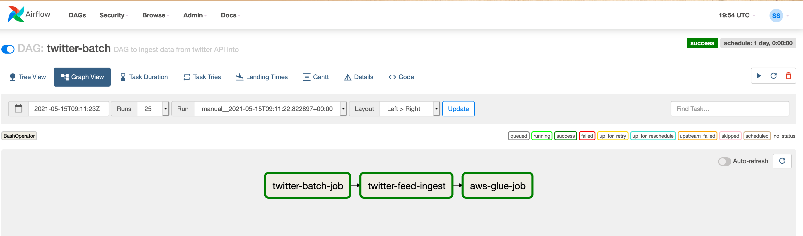
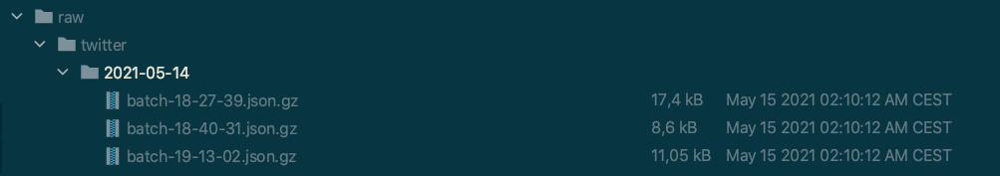
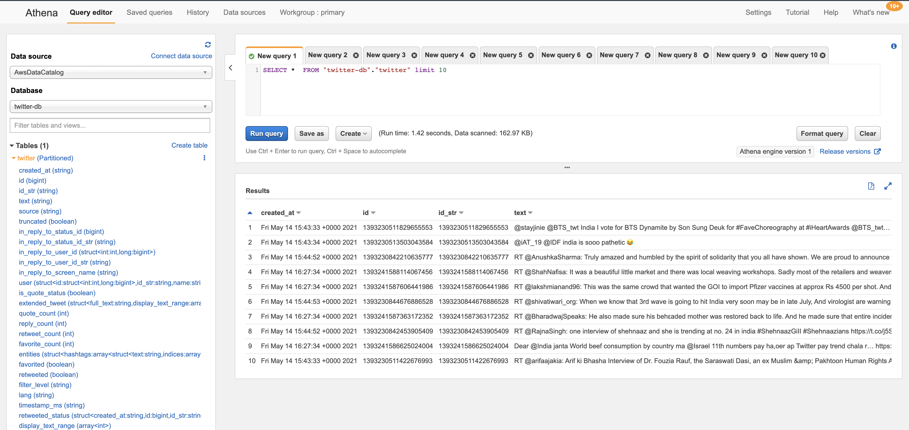
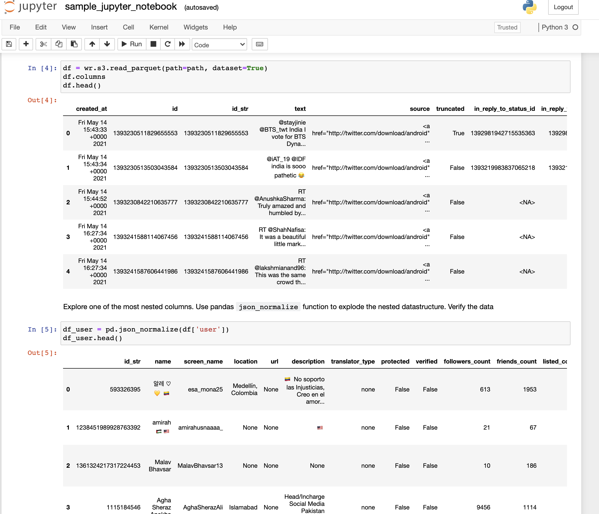
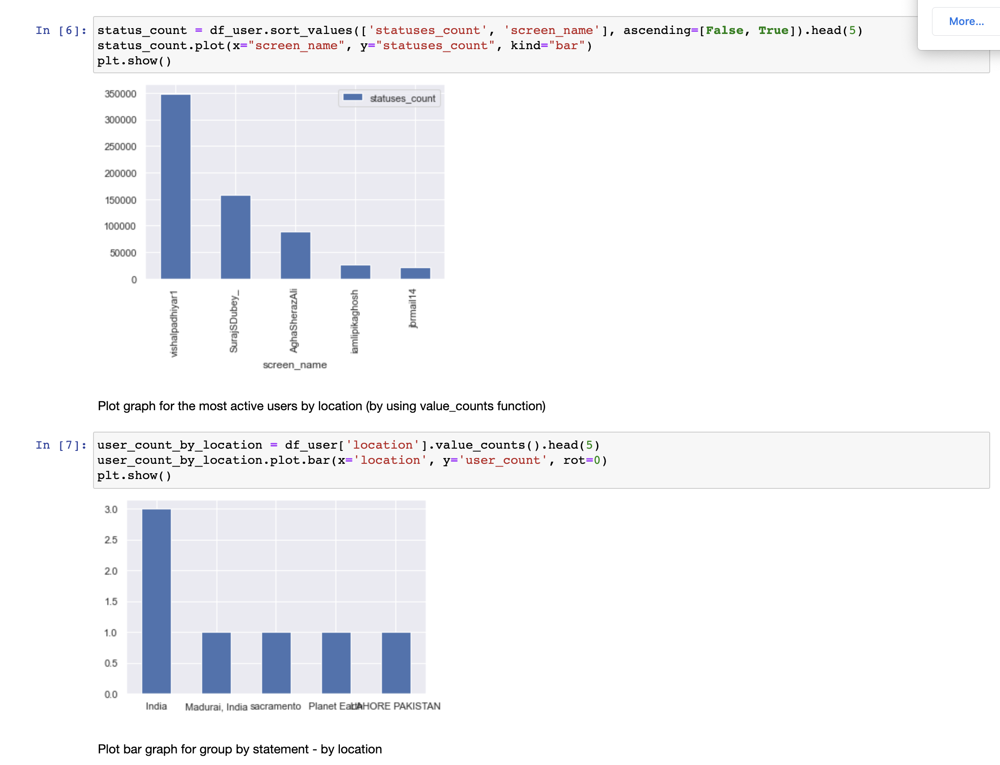

# twitter-data-pipeline

This project is to build a sample data pipeline to ingest the data from twitter API by using proven dataframeworks.
The scope is limited to development of sample code to ingest & process the batch data.

### Data pipeline landscape

The ideal data pipe-line can be projected through the following landscape in the AWS environment. 



As a pre-requisite, please request for twitter developer API credentials.

### Airflow:
To set up aws managed airflow, please refer [this](infra/mwaa/README.md) page.
There will not be any python library, so please install the required libraries.

The apps folder contains the dags and libraries. So copy the apps/ folder cotent into the dags/ folder.


* Tasks:

There are 2 major task in the dag -

1. Ingestion:  
   It will trigger `twitter_s3_connector.py`
2. Data processing:  
   This will trigger the glue job`run_glue_job.py`
   

### Ingestion API:
The project is based on the python programming language and tweepy is a commonly used python library to access Twitter APIs, 
hence this library is used here to extract tweets from twitter.

Following parapmeters need to be populated in the `twitter_configuration.ini` file
```
[TWITTER]
CONSUMER_KEY: [TWITTER_API_CONSUMER_KEY]
CONSUMER_SECRET: [TWITTER_API_CONSUMER_SECRET]
ACCESS_TOKEN: [TWITTER_API_ACCESS_TOKEN]
ACCESS_TOKEN_SECRET: [TWITTER_API_ACCESS_TOKEN_SECRET]

[AWS]
CREDENTIAL_PROFILE: [AWS_CREDENTIAL_PROFILE]
S3_BUCKET: [AWS_S3_BUCKET]
S3_PATH: [AWS_S3_PATH]
REGION: [AWS_REGION]
```
[twitter_s3_connector.py](apps/twitter/src/twitter_s3_connector.py) needs a keyword file to search the pattern or location in tweets.

```
$ python3 twitter_s3_connector.py --help
usage: twitter_s3_connector.py [-h] [-t [TRACK]] [-l [LOCATIONS]] [-s [SIZE]]

optional arguments:
  -h, --help            show this help message and exit
  -t [TRACK], --track [TRACK]
                        Name of file containing keywords i.e. python
  -l [LOCATIONS], --locations [LOCATIONS]
                        Name of file containing geo-locations[longitude, latitude] eg. 20.26, 85.84
  -s [SIZE], --size [SIZE]
                        Number of records to download. Default size is 100
```

The raw(data as it is) data will be stored in S3 bucket inside the raw folder in the following format.



### Data quality check

After having good experience in python based GE, I would like to integrate data quality checks in the data pipeline. Since this is not in the real scope of this POC, this part has been skipped from the data-pipe-line landscape.
More details can be found here : https://docs.greatexpectations.io/en/latest/

### Data procesing 
AWS glue service can be used to process the data.
The terraform iac code can be used to provision the glue job and glue crawler.
However, please be sure that the [data processing code](glue-data-processing/twitter-etl.py) has been uploaded to S3 bucket as the glue iac code need the s3 path as parameter.
More details can be found here [glue infra setup](infra/glue/README.md)
After the data processing the crawler will be triggered to populate the schema

The data will be written into S3 in snappy compressed parquet format.


### Data availability and visualization

The data will be available to query through any sql editor like AWS athena, Presto/Hue, jupyter notebook, tableau etc.
Here are snapshots from Athena and Jupyter notebook etc. The data can be aggregated based on several business use-cases.



Example of [jupyter notebook](sample_jupyter_notebook.ipynb)




